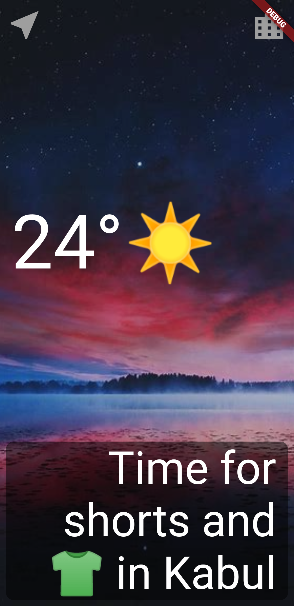

# stub

A Flutter weather app that makes use of routing and statement management.

## Getting Started
This project has been set up of the geolocator package, please
view the details: [geolocator](https://pub.dev/packages/geolocator)

#Requirement
 External dependencies
  - geolocator: ^7.6.2
  - http: ^0.13.3
  - flutter_spinkit: ^5.1.0
  
  
#Screenshot of the Sample project

 

For help getting started with Flutter, view 
[online documentation](https://flutter.dev/docs), which offers tutorials,
samples, guidance on mobile development, and a full API reference.
